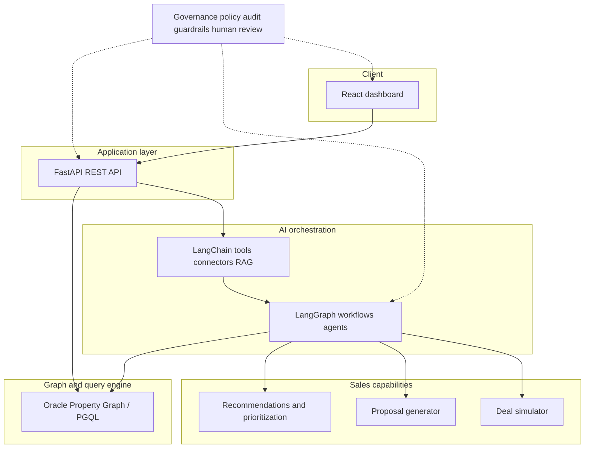
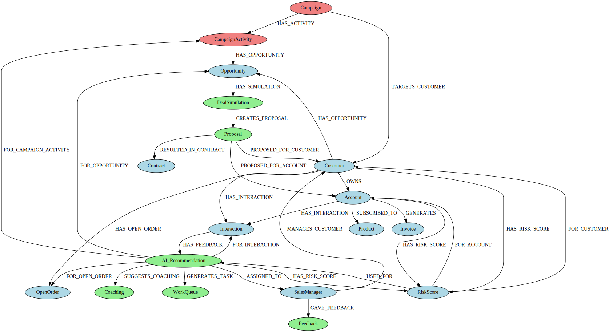
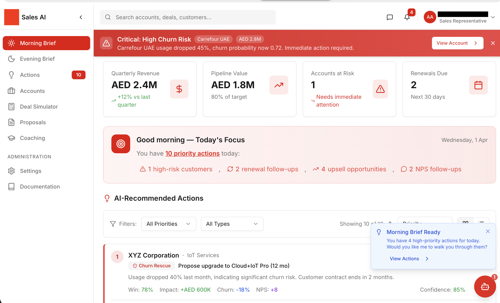
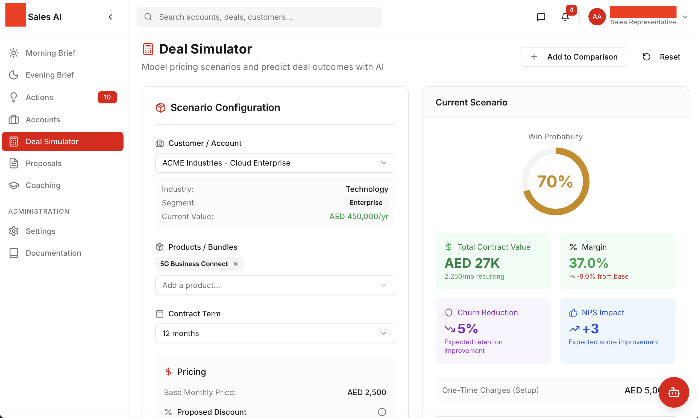

# AI Sales Assistant (LLM + Knowledge Graph System)

## Overview

AI-powered **B2B sales assistant** concept: prioritize engagement, surface risk, and support decisions using a **property graph** for enterprise CRM-style data, **LLM reasoning** for recommendations and explanations, **proposal generation**, and **deal simulation** for what-if analysis—with **governance** for policy, audit, and human-in-the-loop review.

> This public repository is **documentation-first** (knowledge-graph architecture diagram, graph schema, PGQL examples, user guide) plus **`src/`** — small **runnable Python samples** (query builder, Pydantic deal models, LangChain `@tool` pattern, **LLM prompts & JSON parsing** under `src/llm/`). The full application lives in a private monorepo; no credentials or customer data are included here.

## Problem

Sales managers face **high volumes** of accounts and signals. It is hard to **prioritize** outreach, see **churn or risk** early, and run **credible what-if** scenarios.

## Solution

- **Knowledge graph** (Oracle Autonomous Graph / PGQL) models customers, accounts, opportunities, and related entities.
- **LangChain + LangGraph workflows** (in the full system) drive **explainable** recommendations, **proposal drafting**, and natural-language summaries.
- **Deal simulation** explores revenue, churn, and win-probability style scenarios with **human-in-the-loop** feedback to improve relevance.

## Key Features

- AI-assisted **daily actions** and prioritization (see architecture diagram and `docs/knowledge-graph.md`).
- **Explainable** rationale tied to graph-backed context where possible.
- **Proposal generator** support for structured customer-facing documents.
- **Deal simulation** for scenario exploration.
- **Governance** hooks (policy, audit, human review) alongside **feedback loops** to refine recommendations over time.

## Architecture

High-level view: the **FastAPI** backend serves the **React** app, runs the **PGQL / property-graph query engine**, and orchestrates **LangChain** tools plus **LangGraph** workflows for **recommendations**, **proposal generation**, and **deal simulation**. **Governance** (policy, audit, guardrails, human-in-the-loop) applies across API and agent layers.

### Knowledge graph schema (diagram)

## Demo

Anonymized **UI samples** from the full application (additional tabs and modules are described in `docs/user-manual.md`).

## Tech Stack

Python, LangGraph, LangChain, RAG patterns, Oracle Graph DB, FastAPI, React.

## Repository layout

| Path | Description |
|------|-------------|
| `architecture/knowledge-graph-schema.svg` | Property graph schema diagram (nodes and relationships). |
| `docs/screenshots/` | Sample UI: Morning Brief, Deal simulator (PNG). |
| `docs/app-walkthrough.pdf` | Application walkthrough. |
| `docs/knowledge-graph.md` | Node types, attributes, relationships (schema reference). |
| `docs/user-manual.md` | User guide (Markdown). |
| `sample_queries/sample-pgql-queries.txt` | Sample PGQL-style query patterns. |
| `src/` | Runnable samples: PGQL `QueryBuilder`, deal **Pydantic** models, **LangChain** tools, **`src/llm/`** prompts & parsers (copilot, deal sim, **recommendation engine**) — [`src/README.md`](src/README.md). |

## License

MIT License.
